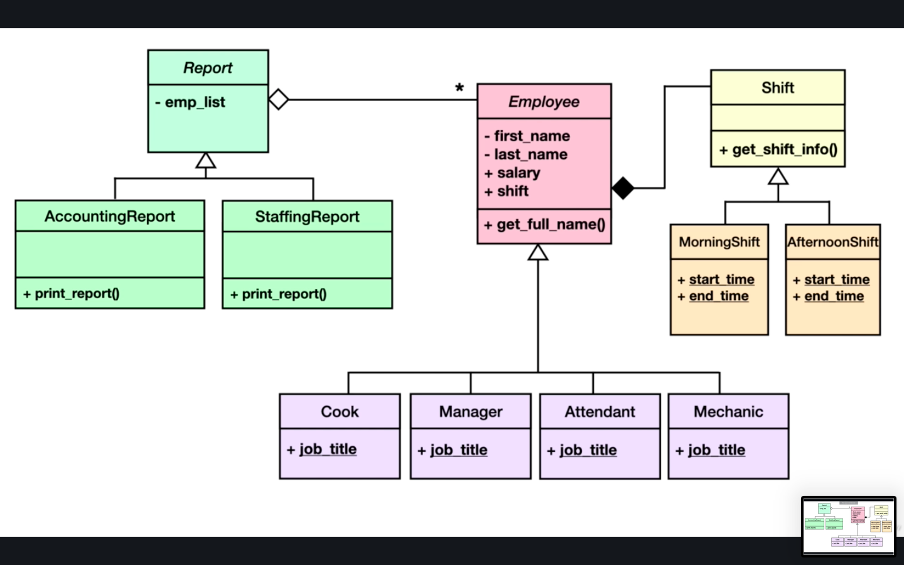

# Udemy's Object Oriented Programming

**Instructor:** Loek van den Ouweland
<https://www.pythonforeveryone.com/en/>

Notes and practice from the class. Best to check commit history to see how this code has changed as the course I'm doing has progressed. For example, this is how it started and what's changed:

1. Bad code: Two lists + a for loop
2. Create an Employee class with two properties instead
3. Create a list with all employees
4. For job titles, add a new property
5. Avoid duplicate code by creating a subclasses for each job title instead
6. Move reports into separate module
7. Inject list of employees into report objects with dependency injection
8. Create superclass to contain emp_list
9. Use polymorphism to print all reports
10. Use association / composition to prevent inheritence explosion

Course link: <https://www.udemy.com/course/learn-object-oriented-programming-with-python>

